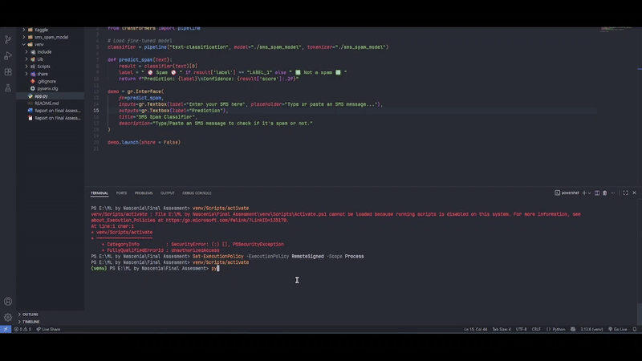

# Machine Learning by Nascenia

## Report on Final Assesment

 

Submitted by:  
***Md. Zayed Al Masud***

 

### Project Description:

#### Title: 
SMS Spam Classifier using Machine Learning
#### Objective: 

The goal of this project is to build an end-to-end system that can automatically classify 
SMS messages as either Spam or Not a Spam.

#### Dataset Details: 
Dataset: SMS Spam Collection Dataset (UCI/Kaggle)  

Size: 5,574 SMS messages labeled as either ham (legitimate) or spam.  

Format: Two columns – label (spam/ham) and text (message body).

SMS spam classifier project addresses the widespread issue of spam messages, which 
can be annoying for users and sometimes malicious. Spam wastes time, clutters 
inboxes, and can be used for phishing attacks. Automatic detection improves user 
experience and security. 

### Solution Overview 
#### Data Preprocessing 
<ul> 
	<li>Loaded dataset from Kaggle.</li>
	<li>Cleaned text: lowercasing, removing punctuation, trimming spaces. </li>
	<li>Encoded labels: ham → 0, spam → 1. </li>
	<li>Split data: 80% training, 20% testing. </li>
</ul>

#### Model Architecture 
<ul> 
	<li>Used Hugging Face Transformers pipeline for text-classification.</li>
	<li>Base model: ‘distilbert-base-uncased’ (pretrained on English text). </li>
	<li>Fine-tuned on SMS Spam dataset with 5 epochs. </li>
</ul>

#### Training
<ul> 
	<li> Used Hugging Face Trainer API.</li>
	<li>Learning rate = 2e-5. </li>
	<li>Evaluation: Accuracy and loss measured per epoch. </li>
	<li> Results: Achieved ~97% validation accuracy.</li>
</ul>

#### Deployment
<ul> 
	<li> Built frontend using Gradio Interface.</li>
	<li>Users can input SMS text and get prediction instantly.  </li>
	<li> Hosted locally. </li>

</ul>

### Project Files
As github does not allow to push large files so the whole project structure with trained models are uploaded in [Google Drive](https://drive.google.com/drive/folders/1T7_Qba9Ak2YdCx3lFyNDJUiRrY3lRbQL?usp=sharing)

### Project Demo

### Challenges and Learnings

#### Challenges Faced
<ul> 
	<li>Library version mismatches (Transformers TrainingArguments keyword errors).  </li>
	<li>Dependency conflicts in Kaggle (e.g., PyTorch CUDA mismatches). </li>
	<li>Styling issues in Gradio when trying to customize background dynamically. </li>

</ul>

#### How They Were Overcome
<ul> 
	<li>Checked Hugging Face version compatibility and used correct arguments. </li>
	<li>Reinstalled matching versions of PyTorch/Transformers. </li>
	<li>Default styling is kept.  </li>

</ul>

#### Key Learnings 
<ul> 
	<li>Fine-tuning pretrained models is far more efficient than training from scratch. </li>
	<li>Hugging Face + Gradio makes end-to-end ML deployment simple.  </li>
	<li>Debugging environment conflicts is a crucial. And also fun when every 
problem is resolved. </li>
</ul>

### References 

[UCI SMS Spam Collection Dataset](https://www.kaggle.com/datasets/uciml/sms-spam-collection-dataset) 

[Hugging Face Transformers](https://huggingface.co/transformers/)
	
[Gradio Documentation:](https://gradio.app/docs/)  
	
[PyTorch Documentation:](https://pytorch.org/docs/stable/) 

